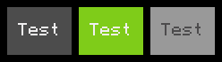

.. _uilib_button:

Button
======

A UI element, that is clickable and executes a function when it is clicked.

  Button in three states: Default, Pressed and Disabled.

**Contents:**

* :ref:`Properties <uilib_button_props>`
* :ref:`Functions <uilib_button_funcs>`

.. _uilib_button_props:

Properties
----------

.. list-table::
    :header-rows: 1

    * - Name
      - Type
      - Default
    * - :ref:`text <uilib_button_props_text>`
      - ``string``
      - ``nil``
    * - :ref:`x <uilib_button_props_x>`
      - ``number``
      - ``nil``
    * - :ref:`y <uilib_button_props_y>`
      - ``number``
      - ``nil``
    * - :ref:`w <uilib_button_props_w>`
      - ``number``
      - ``nil``
    * - :ref:`h <uilib_button_props_h>`
      - ``number``
      - ``nil``
    * - :ref:`style <uilib_button_props_style>`
      - :ref:`uilib.Style <uilib_style>`
      - :ref:`Default Style <uilib_style_funcs_new>`
    * - :ref:`action <uilib_button_props_action>`
      - ``function``
      - ``nil``
    * - :ref:`args <uilib_button_props_args>`
      - ``table``
      - ``nil``
    * - :ref:`toggle <uilib_button_props_toggle>`
      - ``boolean``
      - ``false``
    * - :ref:`visible <uilib_button_props_visible>`
      - ``boolean``
      - ``true``
    * - :ref:`pressed <uilib_button_props_pressed>`
      - ``boolean``
      - ``false``
    * - :ref:`disabled <uilib_button_props_disabled>`
      - ``boolean``
      - ``false``

.. _uilib_button_props_text:

text
^^^^

Text, which is displayed on the button.

.. code-block:: lua

    uilib.Button.text = nil

* **Type:** ``string``
* **Default:** ``nil``

.. note::
   If the text is longer than the :ref:`width <uilib_button_props_w>` of the button with padding in mind, the text will just get cut off.

----

.. _uilib_button_props_x:

x
^^^^

X component of the position on the screen.

.. code-block:: lua

    uilib.Button.x = nil

* **Type:** ``number``
* **Default:** ``nil``

----

.. _uilib_button_props_y:

y
^^^^

Y component of the position on the screen.

.. code-block:: lua

    uilib.Button.y = nil

* **Type:** ``number``
* **Default:** ``nil``

----

.. _uilib_button_props_w:

w
^^^^

Width of the button.

.. code-block:: lua

    uilib.Button.w = nil

* **Type:** ``number``
* **Default:** ``nil``

----

.. _uilib_button_props_h:

h
^^^^

Height of the button.

.. code-block:: lua

    uilib.Button.h = nil

* **Type:** ``number``
* **Default:** ``nil``

----

.. _uilib_button_props_style:

style
^^^^^

Style of the button.

.. code-block:: lua

    uilib.Button.style = uilib.Style:new()

* **Type:** :ref:`uilib.Style <uilib_style>`
* **Default:** :ref:`Default Style <uilib_style_funcs_new>`

----

.. _uilib_button_props_action:

action
^^^^^^

Function, that should be run when the button is clicked.

.. code-block:: lua

    uilib.Button.action = nil

* **Type:** ``function``
* **Default:** ``nil``

----

.. _uilib_button_props_args:

args
^^^^

Arguments to the function specified with :ref:`action <uilib_button_props_action>`.

.. code-block:: lua

    uilib.Button.args = nil

* **Type:** ``table``
* **Default:** ``nil``

.. warning:: 
    The order of arguments within the table should be the same order as the function specified with :ref:`action <uilib_button_props_action>` is expecting it.

----

.. _uilib_button_props_toggle:

toggle
^^^^^^

Enables toggle mode for the button.

.. code-block:: lua

    uilib.Button.toggle = false

* **Type:** ``boolean``
* **Default:** ``false``

----

.. _uilib_button_props_visible:

visible
^^^^^^^

Contains information about the button being visible or not.

.. code-block:: lua

    uilib.Button.visible = true

* **Type:** ``boolean``
* **Default:** ``true``

.. note:: 
    Please use :ref:`show() <uilib_button_funcs_show>` to enable visibility and :ref:`hide() <uilib_button_funcs_hide>` to disable visibility of the button.

----

.. _uilib_button_props_pressed:

pressed
^^^^^^^

Contains information about the button being clicked or not.

.. code-block:: lua

    uilib.Button.pressed = false

* **Type:** ``boolean``
* **Default:** ``false``

.. important:: 
    This property is not meant for being set directly and is usually only set by :ref:`clickEvent() <uilib_button_funcs_clickEvent>`.

----

.. _uilib_button_props_disabled:

disabled
^^^^^^^^

Contains information about the button being disabled or not.

.. code-block:: lua

    uilib.Button.disabled = false

* **Type:** ``boolean``
* **Default:** ``false``

.. note:: 
    Please use :ref:`disable() <uilib_button_funcs_disable>` to toggle if the button should be disabled of the button.

----

.. _uilib_button_funcs:

Functions
---------

* :ref:`new() <uilib_button_funcs_new>`
* :ref:`draw() <uilib_button_funcs_draw>`
* :ref:`clickEvent() <uilib_button_funcs_clickEvent>`
* :ref:`disable() <uilib_button_funcs_disable>`
* :ref:`show() <uilib_button_funcs_show>`
* :ref:`hide() <uilib_button_funcs_hide>`

.. _uilib_button_funcs_new:

new()
^^^^^

Creates a new instance of :ref:`Button <uilib_button>` and returns it.

.. code-block:: lua

    function uilib.Button:new(text, x, y, w, h, action, args, toggle, style)
        ...
        return button
    end

**Arguments:**

.. list-table:: 
    :widths: 20 20 20 40
    :header-rows: 1

    * - Name
      - Type
      - Default
      - Description
    * - **text**
      - ``string``
      - ``nil``
      - Text to be displayed on the button.
    * - **x**
      - ``number``
      - ``nil``
      - X component of position of the button.
    * - **y**
      - ``number``
      - ``nil``
      - Y component of position of the button.
    * - **w**
      - ``number``
      - ``nil``
      - Width of the button.
    * - **h**
      - ``number``
      - ``nil``
      - Height of the button.
    * - **action**
      - ``function``
      - ``nil``
      - Function, that will be executed, when the button is clicked.
    * - **args**
      - ``table``
      - ``nil``
      - Arguments for the function specified above.
    * - **toggle**
      - ``boolean``
      - ``false``
      - Enables toggle mode for the button.
    * - **style**
      - :ref:`uilib.Style <uilib_style>`
      - :ref:`Default Style <uilib_style_funcs_new>`
      - Style of the button for various states.

**Returns:**

.. list-table::
    :widths: 20 80
    :header-rows: 1

    * - Type
      - Description
    * - :ref:`uilib.Button <uilib_button>`
      - Instance of :ref:`Button <uilib_button>` with specified properties.

**Example:**

.. code-block:: lua

    local uilib = require("uilib")

    function onClick(name)
        print("Hello " .. name)
    end

    local btn = uilib.Button:new("Test", 2, 2, 6, 3, onClick, {"User"}, false, uilib.Style:new())

A :ref:`Button <uilib_button>` with the text ``Test`` would be cerated at position ``(2, 2)`` with a size of ``6 x 3`` pixels.
It would execute ``onClick("User")`` when it would be clicked. Toggle mode is disabled for this button, so this button is in one-shot mode.
The button would have the :ref:`default Style <uilib_style_funcs_new>`.

----

.. _uilib_button_funcs_draw:

draw()
^^^^^^

Function to draw the button on the screen.

.. code-block:: lua

    function uilib.Button:draw()
        ...
    end

**Arguments:** ``nil``

**Returns:** ``nil``

**Example:**

.. code-block:: lua

    local uilib = require("uilib")

    function onClick(name)
        print("Hello " .. name)
    end

    local btn = uilib.Button:new("Test", 2, 2, 6, 3, onClick, {"User"}, false, uilib.Style:new())
    btn:draw()

An instance of :ref:`Button <uilib_button>` will be created with the :ref:`new() <uilib_button_funcs_new>` method and the returned button will be drawn to the screen.

----

.. _uilib_button_funcs_clickEvent:

clickEvent()
^^^^^^^^^^^^

Function that checks if a click event was on the button and executes :ref:`action <uilib_button_props_action>` if it was. It will not execute the function if the button is either disabled or not visible.

.. code-block:: lua

    function uilib.Button:clickEvent(ex, ey)
        ...
        return ret
    end

**Arguments:**

.. list-table:: 
    :widths: 20 20 20 40
    :header-rows: 1

    * - Name
      - Type
      - Default
      - Description
    * - **ex**
      - ``number``
      - ``false``
      - X component of the event position.
    * - **ey**
      - ``number``
      - ``false``
      - Y component of the event position.
  
**Returns:**

.. list-table::
    :widths: 20 80
    :header-rows: 1

    * - Type
      - Description
    * - ``table``
      - Return values from the function specified in :ref:`action <uilib_button_props_action>`

**Example:**

.. code-block:: lua

    local uilib = require("uilib")

    function onClick(name)
        print("Hello " .. name)
    end

    local btn = uilib.Button:new("Test", 2, 2, 6, 3, onClick, {"User"}, false, uilib.Style:new())
    
    while true do
      local e, btn, x, y = os.pullEvent("mouse_click")
      btn:clickEvent(x, y)
    end

An instance of :ref:`Button <uilib_button>` will be created with the :ref:`new() <uilib_button_funcs_new>` method.
After that it will wait for a ``mouse_click`` event. If this event happened inside the button, the :ref:`action <uilib_button_props_action>` function will be executed.

----

.. _uilib_button_funcs_disable:

disable()
^^^^^^^^^

Function to disable or enable the button.

.. code-block:: lua

    function uilib.Button:disable(status)
        ...
    end

**Arguments:**

.. list-table:: 
    :widths: 20 20 20 40
    :header-rows: 1

    * - Name
      - Type
      - Default
      - Description
    * - **status**
      - ``boolean``
      - Inverse of :ref:`disabled <uilib_button_props_disabled>`
      - Specifies if it should be disabled or not.

.. note:: 
  If **status** is omitted, the function toggles the :ref:`disabled <uilib_button_props_disabled>` flag.
  If **status** is specified however, the function will set the :ref:`disabled <uilib_button_props_disabled>` flag to **status**.

**Returns:** ``nil``

**Example:**

.. code-block:: lua

    local uilib = require("uilib")

    function onClick(name)
        print("Hello " .. name)
    end

    local btn = uilib.Button:new("Test", 2, 2, 6, 3, onClick, {"User"}, false, uilib.Style:new())
    btn:disable(true)

An instance of :ref:`Button <uilib_button>` will be created with the :ref:`new() <uilib_button_funcs_new>` method.
Adter that the button will be disabled.

----

.. _uilib_button_funcs_show:

show()
^^^^^^

Function to make the button visible.

.. code-block:: lua

    function uilib.Button:show()
        ...
    end

**Arguments:** ``nil``

**Returns:** ``nil``

**Example:**

.. code-block:: lua

    local uilib = require("uilib")

    function onClick(name)
        print("Hello " .. name)
    end

    local btn = uilib.Button:new("Test", 2, 2, 6, 3, onClick, {"User"}, false, uilib.Style:new())
    btn:show()

An instance of :ref:`Button <uilib_button>` will be created with the :ref:`new() <uilib_button_funcs_new>` method.
Adter that the button will be made visible.

----

.. _uilib_button_funcs_hide:

hide()
^^^^^^

Function to make the button invisible.

.. code-block:: lua

    function uilib.Button:hide()
      ...
    end

**Arguments:** ``nil``

**Returns:** ``nil``

**Example:**

.. code-block:: lua

    local uilib = require("uilib")

    function onClick(name)
        print("Hello " .. name)
    end

    local btn = uilib.Button:new("Test", 2, 2, 6, 3, onClick, {"User"}, false, uilib.Style:new())
    btn:hide()

An instance of :ref:`Button <uilib_button>` will be created with the :ref:`new() <uilib_button_funcs_new>` method.
Adter that the button will be made invisible.