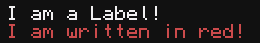

.. _uilib_label:

Label
=====

A UI element, that displays plain text.

  Labels with two styles.

**Contents:**

* :ref:`Properties <uilib_label_props>`
* :ref:`Functions <uilib_label_funcs>`

.. _uilib_label_props:

Properties
----------

.. list-table::
    :header-rows: 1

    * - Name
      - Type
      - Default
    * - :ref:`text <uilib_label_props_text>`
      - ``string``
      - ``nil``
    * - :ref:`x <uilib_label_props_x>`
      - ``number``
      - ``nil``
    * - :ref:`y <uilib_label_props_y>`
      - ``number``
      - ``nil``
    * - :ref:`style <uilib_label_props_style>`
      - :ref:`uilib.Style <uilib_style>`
      - :ref:`Default Style <uilib_style_funcs_new>`
    * - :ref:`visible <uilib_label_props_visible>`
      - ``boolean``
      - ``true``

.. _uilib_label_props_text:

text
^^^^

Text, which the label will display.

.. code-block:: lua

    uilib.Label.text = nil

* **Type:** ``string``
* **Default:** ``nil``

----

.. _uilib_label_props_x:

x
^^^^

X component of the position on the screen.

.. code-block:: lua

    uilib.Label.x = nil

* **Type:** ``number``
* **Default:** ``nil``

----

.. _uilib_label_props_y:

y
^^^^

Y component of the position on the screen.

.. code-block:: lua

    uilib.Label.y = nil

* **Type:** ``number``
* **Default:** ``nil``

----

.. _uilib_label_props_style:

style
^^^^^

Style of the label.

.. code-block:: lua

    uilib.Label.style = uilib.Style:new()

* **Type:** :ref:`uilib.Style <uilib_style>`
* **Default:** :ref:`Default Style <uilib_style_funcs_new>`

----

.. _uilib_label_props_visible:

visible
^^^^^^^

Contains information about the label being visible or not.

.. code-block:: lua

    uilib.Label.visible = true

* **Type:** ``boolean``
* **Default:** ``true``

.. note:: 
    Please use :ref:`show() <uilib_label_funcs_show>` to enable visibility and :ref:`hide() <uilib_label_funcs_hide>` to disable visibility of the button.

.. _uilib_label_funcs:

Functions
---------

* :ref:`new() <uilib_label_funcs_new>`
* :ref:`draw() <uilib_label_funcs_draw>`
* :ref:`show() <uilib_label_funcs_show>`
* :ref:`hide() <uilib_label_funcs_hide>`

.. _uilib_label_funcs_new:

new()
^^^^^

Function to create a new instance of :ref:`Label <uilib_label>`.

.. code-block:: lua

    function M.Label:new(text, x, y, style)
      ...
      return label
    end

**Arguments:**

.. list-table:: 
    :widths: 20 20 20 40
    :header-rows: 1

    * - Name
      - Type
      - Default
      - Description
    * - **text**
      - ``string``
      - ``nil``
      - Text, which the label will display.
    * - **x**
      - ``number``
      - ``nil``
      - X component of position of the label.
    * - **y**
      - ``number``
      - ``nil``
      - Y component of position of the label.
    * - **style**
      - :ref:`uilib.Style <uilib_style>`
      - :ref:`Default Style <uilib_style_funcs_new>`
      - Style of the label.

.. note:: 
    Labels can only use the :ref:`default state <uilib_style_states>` for styling.

**Returns:**

.. list-table::
    :widths: 20 80
    :header-rows: 1

    * - Type
      - Description
    * - :ref:`uilib.Label <uilib_label>`
      - Instance of :ref:`Label <uilib_label>` with specified properties.

**Example:**

.. code-block:: lua

  local uilib = require("uilib")
  local label = uilib.Label("I am a Label!", 4, 5, uilib.Style:new(colors.red, colors.gray))

This would create an instance of a :ref:`Label <uilib_label>` with the text ``I am a Label!`` with ``colors.red`` text on ``colors.gray`` background at position ``(4, 5)``.

----

.. _uilib_label_funcs_draw:

draw()
^^^^^^

Function to draw the label.

.. code-block:: lua

  function M.Label:draw()
    ...
  end

**Arguments:** ``nil``

**Returns:** ``nil``

**Example:**

.. code-block:: lua

  local uilib = require("uilib")
  local label = uilib.Label("I am a Label!", 4, 5, uilib.Style:new(colors.red, colors.gray))
  label:draw()

This would create an instance of :ref:`Label <uilib_label>` and draw it to the screen.

----

.. _uilib_label_funcs_show:

show()
^^^^^^

Function to make the label visible.

.. code-block:: lua

    function uilib.Label:show()
        ...
    end

**Arguments:** ``nil``

**Returns:** ``nil``

**Example:**

.. code-block:: lua

    local uilib = require("uilib")
    local label = uilib.Label("I am a Label!", 4, 5, uilib.Style:new(colors.red, colors.gray))
    label:show()

This would create an instance of :ref:`Label <uilib_label>` and make it visible.

----

.. _uilib_label_funcs_hide:

hide()
^^^^^^

Function to make the label invisible.

.. code-block:: lua

    function uilib.Label:hide()
      ...
    end

**Arguments:** ``nil``

**Returns:** ``nil``

**Example:**

.. code-block:: lua

    local uilib = require("uilib")
    local label = uilib.Label("I am a Label!", 4, 5, uilib.Style:new(colors.red, colors.gray))
    label:hide()

This would create an instance of :ref:`Label <uilib_label>` and make it invisible.